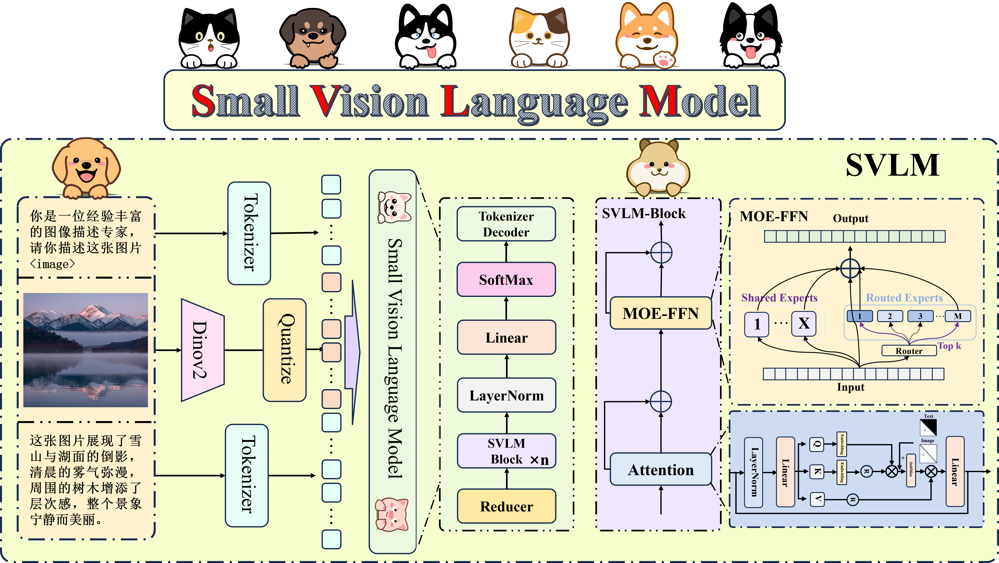
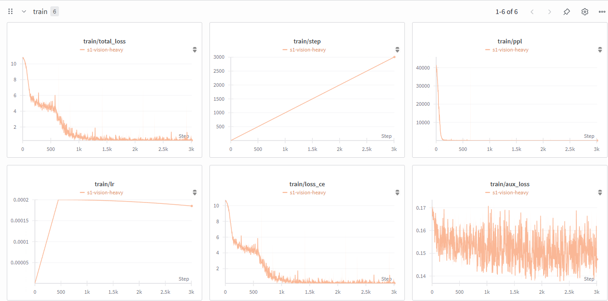

# Small Vision Language Model (SVLM)

## 🏗 模型结构示意 (Model Architecture)


---
## 庖丁解牛 (Starting small, thinking big)

本项目从零开始手搓视觉-文本统一的多模态大模型，**显存 8GB 即可训练**，适合初学者和低算力人群进行实践与学习。  
This project builds a **vision-language unified multimodal model from scratch**, requiring **only 8GB GPU memory** to train. It is designed for beginners and users with limited resources.  

📌 **特点 / Features:**  
- 🔧 从零实现 / Implemented from scratch  
- 💻 低算力可跑 / Runs on limited resources  
- 📚 适合学习与实践 / Suitable for learning & practice  
- 🌐 简洁高效 / Compact & efficient  

---
## 📷 效果展示 (Project Showcase)


---

## 📈 训练效果曲线 (Training Curves)



---
## 🚀 快速开始 (Quickstart)

只需几行代码即可运行一个简单的推理示例：  
Run a simple inference demo in just a few lines:

```python
from svlm import SVLMModel

# 初始化模型
model = SVLMModel.from_pretrained("YourModelPath")

# 输入图像和文本
image = "Image/demo.png"
text = "What is in the picture?"

# 执行推理
output = model.predict(image, text)

print("Result:", output)
